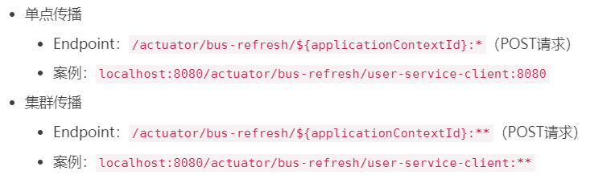

### Spring config server
构建了Confg Server,并通过构造URL的方式，获取了Git仓库中的
配置信息。
将Config Server也加入到消息总线中,并使用Config Server的/bus/refresh
端点来实现配置的刷新。这样，各个config client 微服务只需要关注自身的业务，而不再承担配置刷
新的职责。
cmd 执行如下
curl -X POST http://localhost:8080/actuator/bus-refresh
如图，可以只更新某个节点，也可以更新某个集群

